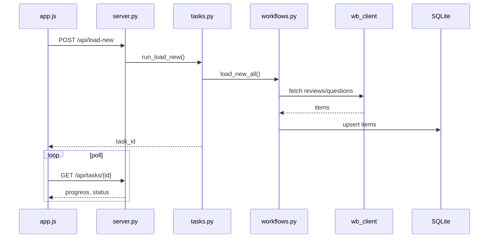
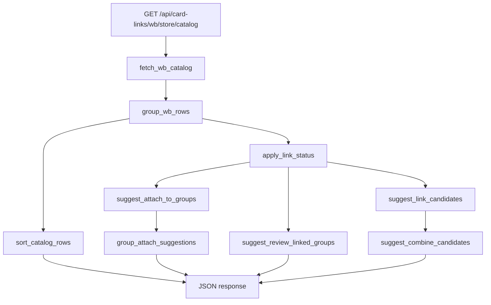

# Архитектура WB AutoReply App

## Обзор

Приложение построено как **монолит** с разделением на слои:

```
┌─────────────────────────────────────────────────────────────┐
│  UI: app/web/static (SPA)  │  app/main.py (CustomTkinter)    │
└────────────────────────────┬────────────────────────────────┘
                             │ HTTP / прямые вызовы
┌────────────────────────────▼────────────────────────────────┐
│  app/web/server.py — FastAPI (~70 REST endpoints, ~3980 строк) │
│  app/web/tasks.py — фоновые задачи (load/generate/send)     │
│  app/web/store_locks.py — блокировки по store_id            │
│  app/web/task_control.py — отмена задач                     │
└────────────────────────────┬────────────────────────────────┘
                             │
┌────────────────────────────▼────────────────────────────────┐
│  app/core/workflows.py — оркестрация бизнес-процессов       │
│  app/core/*_client.py — клиенты маркетплейсов               │
│  app/core/card_links.py — связки карточек (~2300 строк)     │
│  app/core/openai_client.py — OpenAI                         │
│  app/agent/* — AI-агент                                     │
└────────────────────────────┬────────────────────────────────┘
                             │
┌────────────────────────────▼────────────────────────────────┐
│  app/db.py — SQLite (stores, items, users, audit, alerts)   │
│  data/reviews.db                                            │
└─────────────────────────────────────────────────────────────┘
```

## Слой данных (`app/db.py`)

### Таблицы

| Таблица | Назначение |
|---------|------------|
| `stores` | Магазины: marketplace, name, api_key, client_id, business_id, active |
| `items` | Отзывы/вопросы: `external_id`, `item_type`, `status`, `generated_text`, `extra_json` (Ozon sku и др.) |
| `prompts` | Промпты по item_type + rating_group |
| `app_settings` | key-value настройки (OpenAI, Telegram, авто-расписание) |
| `users` | username, password_hash (PBKDF2), role |
| `user_permissions` | guest permissions: view_settings, view_log, view_ops_log |
| `audit_events` | Аудит действий |
| `ozon_sku_cache` | Кэш названий SKU |
| `buyer_chat_replies` | История ответов в чатах |
| `card_error_alerts` | Ошибки карточек из отзывов/чатов |
| `ozon_important_alerts` | Важные сообщения поддержки Ozon |
| `card_links_master_items` | Кэш карточек WB для мастера связок |
| `card_links_master_bundles` | План связок мастера (до 29 SKU) |
| `card_links_master_state` | Шаги, лог, время загрузки каталога |

### Потокобезопасность

- `sqlite3.connect(..., check_same_thread=False)`
- Глобальный `threading.RLock()` на операции БД
- Web: один экземпляр `Database` на процесс (`get_db()`)

## Слой core

### Клиенты и вспомогательные модули

| Модуль | Класс/роль |
|--------|------------|
| `wb_client.py` | `WbClient` — отзывы, вопросы WB |
| `wb_content_client.py` | Content API — карточки, imtID, merge |
| `wb_buyer_chat.py` | Чаты покупателей WB |
| `ozon_client.py` | `OzonClient` — seller API |
| `ozon_buyer_chat.py` | Чаты Ozon (buyer + support) |
| `ozon_actions.py` | Промо-акции |
| `ozon_alerts.py` | Классификация сообщений поддержки |
| `yam_client.py` | Яндекс.Маркет: отзывы, вопросы, ответы (без чатов и card-links) |
| `net.py` | `HttpStatusError`, `UnauthorizedStoreError`, retry |
| `openai_client.py` | `OpenAIClient` — chat completions (default `gpt-5.2`) |
| `chat_common.py` | Общая логика чатов: даты отсечки, ключи сообщений |
| `card_check.py` | Детекция ошибок карточки в тексте покупателя + Telegram |
| `quality_metrics.py` | Показатели качества Ozon для сводки (кэш 30 мин) |
| `config_backup.py` | Экспорт/импорт конфигурации (`/api/config/*`) |
| `secret_mask.py` | Маскирование секретов в API и аудите |
| `telegram_notify.py` | Telegram-уведомления и отчёты |
| `async_runner.py` | Asyncio в отдельном потоке (desktop) |

### Workflows (`workflows.py`)

Центральный модуль async-операций (~2030 строк):

- `load_new_items` / `load_new_all` — загрузка отзывов/вопросов (WB, Ozon, YAM)
- `generate_mass` — генерация ответов OpenAI
- `send_mass` / `send_mass_all` — отправка на площадки
- `generate_wb_buyer_chat_reply` / `generate_ozon_buyer_chat_reply` — черновики в чатах
- `wb_buyer_chats_mass_generate_send_for_store` / `ozon_buyer_chats_mass_generate_send_for_store`
- `auto_process_wb_buyer_chats` / `auto_process_ozon_buyer_chats` — авто-чаты
- `ozon_actions_auto_remove_for_store` — авто-удаление из акций
- `scan_ozon_important_alerts_for_store` / `auto_process_ozon_important_alerts`
- Интеграция с `card_check`, `telegram_notify`, `ozon_alerts`

Вызывается из:
- Desktop (`AsyncRunner` в отдельном потоке)
- Web tasks (`app/web/tasks.py`)
- Auto-scheduler (`server.py` → `_run_auto_slot`)

### Card Links (`card_links.py`)

Крупнейший доменный модуль. Ответственность:

1. **Загрузка каталога:** `fetch_wb_catalog`, `fetch_ozon_catalog`
2. **Группировка:** `group_wb_rows` (по imtID), `group_ozon_rows` (по model_name / related_sku)
3. **Статус linked:** `apply_link_status` — linked только при 2+ SKU в группе
4. **Предложения:**
   - `suggest_link_candidates` — новые связки (похожие названия)
   - `suggest_attach_to_groups` — одиночки → существующие связки
   - `group_attach_suggestions` — пулы attach в одну связку
   - `suggest_combine_candidates` — объединение нескольких new_link
   - `suggest_review_linked_groups` — перепроверка/перепривязка
5. **Операции:** `wb_merge_cards`, `wb_disconnect_cards`, `ozon_link_by_model`, `ozon_unlink_cards`, `link_ozon_tms_qty_groups`
6. **ИИ:** `ai_suggest_card_links`
7. **Сортировка каталога:** `sort_catalog_rows` (категория → связки → одиночки)

Эвристики сопоставления названий: `_title_base_key`, `_titles_related_enough`, `_item_matches_group`, `_item_matches_group_attach`.

Лимит: `MAX_LINK_ITEMS = 30`.

### Card Links Master (`card_links_master.py`)

Отдельный конвейер WB (вкладка «Мастер связок»), **не** заменяет ИИ/каталог/перепроверку:

1. **Load** — каталог + группы в SQLite (`card_links_master_*`)
2. **Brands / Segment / Classify** — правила + опционально OpenAI батчами по subject
3. **Plan** — детерминированные связки до **29** SKU (IKEA / дом / косметика / запчасти)
4. **Apply** — `wb_merge_cards(disconnect_first=True)`, крупные пачки первыми, store lock `card_links`

Кэш: таблицы `card_links_master_items`, `card_links_master_bundles`, `card_links_master_state`.

### Безопасность секретов (`secret_mask.py`)

- Маскирование в GET `/api/settings`
- Write-only поля в UI (сохранение замаскированного = не менять)
- Редакция в аудите и логах

## Слой web (`app/web/`)

### `server.py`

Единая точка HTTP API (~70 routes). **Полный справочник:** [API.md](./API.md).

Группы endpoints (кратко):

| Префикс | Функциональность |
|---------|------------------|
| `/api/auth/*` | login, logout, me, admin-reset |
| `/api/users/*` | CRUD пользователей, permissions |
| `/api/stores/*` | CRUD магазинов (wb / ozon / yam) |
| `/api/items/*` | Очередь отзывов/вопросов |
| `/api/settings`, `/api/prompts` | Настройки и промпты |
| `/api/config/*` | Экспорт/импорт backup JSON |
| `/api/telegram/*` | test, report-now |
| `/api/auto-schedule/*` | Расписание, run-now, stop, disable |
| `/api/agent/*` | AI-агент сессии |
| `/api/load-new`, `/api/generate`, `/api/send`, `/api/apply-template` | Массовые операции → tasks |
| `/api/tasks/{id}` | Статус и отмена фоновых задач |
| `/api/wb/buyer-chats/*` | Чаты WB |
| `/api/ozon/buyer-chats/*` | Чаты Ozon (filter: buyers / support / all) |
| `/api/ozon/actions/*` | Акции и автоудаление |
| `/api/card-links/*` | Связки WB/Ozon |
| `/api/card-errors`, `/api/ozon/alerts` | Алерты |
| `/api/stats`, `/api/quality-metrics` | Статистика и качество Ozon |
| `/api/log/*` | dev / ops / legacy log |
| `/health`, `/api/health` | Healthcheck |

Статика: `/static/*`, SPA: `/`, `/app`, `/login`, `/reset`.

### Фоновые процессы (startup)

```python
@app.on_event("startup"):
  - bootstrap admin
  - _auto_scheduler_loop()      # MSK слоты
  - _telegram_report_loop()
  - start_telegram_agent_task()
```

### Задачи (`tasks.py`)

In-memory хранилище `_tasks` с TTL 1 ч, макс. 120 завершённых задач. Паттерн:

1. POST `/api/load-new` → `task_id`
2. GET `/api/tasks/{task_id}` → progress `[done, total]`
3. `store_locks` предотвращает параллельные операции на одном магазине
4. `task_control.TaskControl` — кооперативная отмена задачи

### Frontend (`static/`)

| Файл | Роль |
|------|------|
| `index.html` | Разметка всех панелей (~1250 строк) |
| `app.js` | Вся логика UI (~5900 строк) |
| `styles.css` | Стили (~4150 строк) |
| `login.html` | Анимированный login (cat mascot) |
| `sw.js` | Service worker (PWA) |
| `manifest.json` | PWA manifest |

Кэш-бастинг: `?v=N` на app.js и styles.css.

**Индикаторы прогресса** (обязательны для операций >~1 с): три компонента в `app.js` — `showProgress`, `showStepProgress`, `showRingProgress`; экспорт `window.MarketAIProgress`. Контейнеры `.progress-container` в `index.html`. Подробности и чеклист: [AI_CONTEXT.md](./AI_CONTEXT.md#прогресс-для-долгих-операций-обязательно).

Card-links UI: три вкладки (Предложения / Перепроверка / Каталог), панели bulk-apply/combine/review, pickers связок.

## AI-агент (`app/agent/`)

| Файл | Роль |
|------|------|
| `orchestrator.py` | JSON-план агента, подтверждение write-операций |
| `tools.py` | **25 инструментов** → workflows / tasks / card_links |
| `playbooks.py` | Составные pipeline (reviews, questions, buyer chats, promotions) |
| `session.py` | In-memory сессии диалога |
| `telegram_bot.py` | Long polling Telegram → orchestrator |
| `formatting.py` | Форматирование ответов |

### Инструменты агента (`tools.py`)

Read: `list_stores`, `get_stats`, `list_queue_items`, `get_auto_schedule_status`, `get_quality_summary`, `get_task_status`, `list_active_tasks`, `export_dialog`, `list_recent_operations`, `list_card_errors`, `list_ozon_alerts`, `check_ozon_promotions`, `check_buyer_chats`, `list_product_cards`.

Write (требуют подтверждения): `load_new_items`, `generate_answers`, `send_answers`, `run_auto_schedule_now`, `stop_auto_schedule`, `apply_template`, `send_telegram_broadcast`, `send_telegram_report_now`, `pipeline_answer_reviews`, `pipeline_answer_questions`, `remove_ozon_promotions`, `pipeline_buyer_chats`, `link_product_cards`, `unlink_product_cards`.

Агент **не** вызывает API маркетплейсов напрямую — только через `tools` и `web_tasks`.

## Desktop (`app/main.py`)

- CustomTkinter UI, темы из `THEMES`
- `AsyncRunner` — asyncio в фоновом потоке
- Те же `workflows` и `Database`
- **Ограничение macOS:** нельзя запускать Tk из терминала Cursor/VS Code

## Диаграмма: загрузка отзывов (web)



## Диаграмма: card-links catalog



## Технический долг (архитектурный)

1. **Монолит server.py** — сложно тестировать и ревьюить
2. **Монолит app.js** — нет модульной сборки, один файл на всё UI
3. **Дублирование сортировки каталога** — `sort_catalog_rows` (backend) + `cardLinksSortCatalogRows` (frontend)
4. **In-memory tasks/sessions** — не переживают рестарт, нет горизонтального масштабирования
5. **SQLite** — не подходит для multi-instance без внешнего storage
6. **Desktop + Web** — двойная поддержка UI при одной бизнес-логике
7. **Нет тестов** — регрессии ловятся вручную

## Деплой

### Render

- `render.yaml`: build `requirements-web.txt`, start uvicorn
- Env: `SESSION_SECRET`, опционально disk на `/data`

### Timeweb VPS

- `deploy/timeweb/setup_vps.sh` — venv, nginx, systemd, `/etc/wb_autoreply.env`
- `nginx-site.conf.template`, `wb-autoreply.service.template`
- Данные: `data/reviews.db` на диске VPS (сохраняются между деплоями)

## Связанные документы

- [API.md](./API.md) — полный справочник endpoints
- [ENV.md](./ENV.md) — env и ключи `app_settings`
- [PROJECT.md](./PROJECT.md) — обзор и запуск
